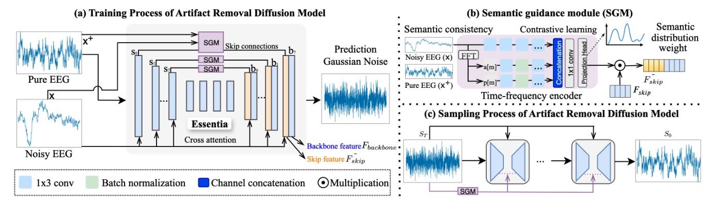

This is the Official PyTorch implementation of our ICASSP2025 paper "Essentia: Boosting Artifact Removal from EEG through Semantic Guidance Utilizing Diffusion Model".

# Essentia: Boosting Artifact Removal from EEG through Semantic Guidance Utilizing Diffusion Model



## Quick Start
### Install
```
# build with python3.10
conda create --name Essentia python=3.10
conda activate Essentiaenv 
pip install -r requirments.txt
```

### Usage
#### Before usage
1. We provide a data loading API in our code, which can be customized to suit the characteristics of specific datasets.
2. The detailed loading functions are available in `Code/func.py` and `Code/TrainContrastive.py`.

#### Run Model
1. For running the Essentia, you should use command `python Code/TrainContrastive.py`
